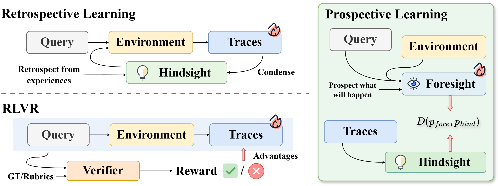
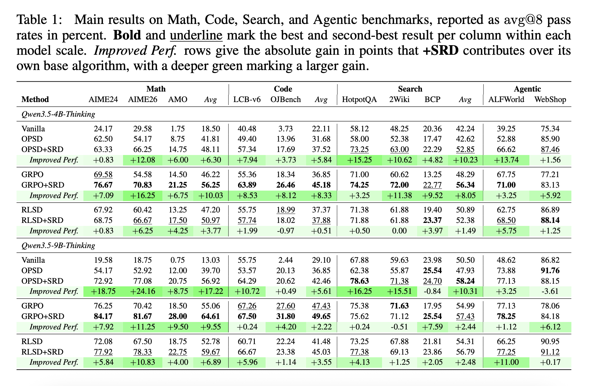
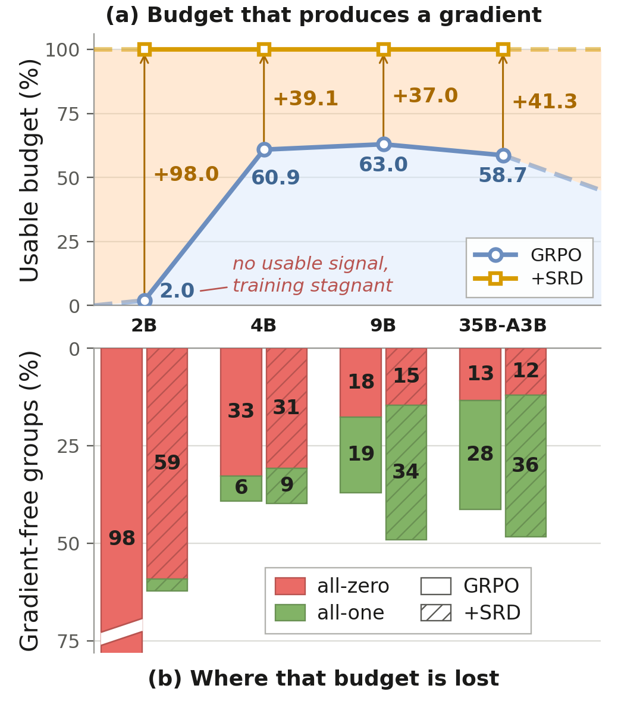
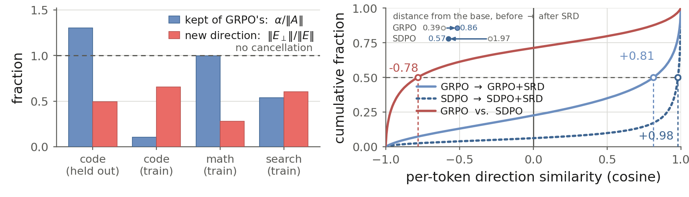
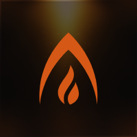

<div align="center">

# 🔭 Self-Retrospection Distillation
### Prospective Learning: Turning Post-hoc Experiences into Prior Foresight

<p align="center">
  <b>Haoxiang Zhang*</b>, <b>Qinglin Chen*</b>, <b>Hiroaki Hayashi*</b>, <b>Zhuofeng Li*</b>, <b>Siming Zhang*</b><br>
  Jiaxin Zhang, Jixuan Chen, Fang Wu, Pan Lu, Silvio Savarese, Julian McAuley, Chien-Sheng Wu
</p>

<p align="center">
  <em>Salesforce AI Research · UC San Diego · Texas A&amp;M University · Stanford University</em>
</p>

<a href="https://arxiv.org/abs/2610.08077"></a>
<a href="#"></a>
<a href="https://github.com/SalesforceAIResearch/SRD"></a>

<!-- Add the method teaser here once finalized, e.g.:
 -->

</div>

---

## 📰 News

- **[Oct 2026]** 🚀 SRD [preprint](https://arxiv.org/abs/2610.08077) released!

## TL;DR

**Self-Retrospection Distillation (SRD)** is an implementation of *prospective
learning*: it aligns the agent's **pre-interaction anticipation** of what a task and
environment will demand with the **summary of experience** gathered *after*
interacting. As a lightweight auxiliary objective, SRD guides and reinforces RLVR
and self-distillation training rather than replacing it. We find that it brings
consistent gains over the base **GRPO / OPSD / RLSD** algorithms across tool-use
reasoning, deep research, and simple agentic tasks.

## 🌟 Overview

<p align="center"></p>
<p align="center"><sub><b>Figure 1.</b> SRD pairs a pre-interaction <i>foresight</i> prediction with a <i>hindsight</i>-conditioned one and aligns them on the agent's own foresight rollout — turning post-hoc experience into prior foresight.</sub></p>

<details>
<summary><b>Contrast with prior experience-use paradigms</b></summary>
<br/>
<p align="center"></p>
<p align="center"><sub><b>Figure 2.</b> Retrospective RLVR / self-distillation condition the teacher on hindsight to sharpen the next action; SRD instead uses hindsight to supervise foresight, extracting signal even from reward-uniform groups.</sub></p>
</details>

## ✨ Key features

- **Prospective self-distillation.** A lightweight auxiliary objective that aligns
  the agent's pre-interaction *foresight* with its post-interaction *hindsight*,
  layered on top of RLVR / self-distillation.
- **Model choices from 4B to 35B-A3B.** Qwen3.5-4B / 9B / 35B-A3B, one launcher.
- **Diverse eval benchmarks.** Math (AIME, AMO-Bench), Code (LiveCodeBench,
  OJBench), Search (HotpotQA, 2WikiMultiHopQA), and Agent (ALFWorld, WebShop).
- **A sandbox per tool.** Each tool — code interpreter, search retriever, WebShop,
  ALFWorld — runs in its own containerized sidecar, so they can be deployed
  separately and on their own resources.
- **Enroot launch, no local setup.** A one-click enroot start needs no local
  environment; unlike Docker it shares the host network namespace with no daemon,
  adapting cleanly across heterogeneous machines.

## 🛠 Environment & setup

1. **Container image.** We use the `miles` CUDA-12 release image
   (`radixark/miles:v0.1.0-cu12` — torch 2.11.0+cu129, with Megatron-LM + SGLang
   baked in). Point the launcher at it with `IMAGE` / `SQSH` (the launcher imports
   it once into the enroot squashfs).

2. **Install enroot** on the host (one-off — the image is imported into an enroot
   squashfs, so no Docker daemon runs inside the training container):
   ```bash
   arch=$(dpkg --print-architecture)
   curl -fSsL -O https://github.com/NVIDIA/enroot/releases/download/v3.5.0/enroot_3.5.0-1_${arch}.deb
   sudo apt install -y ./enroot_3.5.0-1_${arch}.deb
   ```

3. **Secrets** — create `examples/SRD/.env` (gitignored, never committed):
   ```bash
   WANDB_API_KEY=...          # wandb.ai → User Settings → API keys (wandb.ai/authorize)
   HF_TOKEN=...               # huggingface.co → Settings → Access Tokens
   # optional LLM-as-judge (used only as a search-domain grading fallback):
   OPENAI_API_URL=...         # base URL of your OpenAI-compatible gateway (e.g. https://api.openai.com/v1)
   LLM_GATEWAY_KEY=...        # API key for OPENAI_API_URL (your OpenAI key if that is the endpoint)
   SDPO_REACT_JUDGE_MODEL=gpt-5.6-luna  # judge model name served by that gateway
   ```

4. **Scratch root** for models / data / checkpoints, on a big disk:
   ```bash
   export SDPO_REACT_LOCAL_ROOT=/path/on/a/big/disk
   ```

5. **Data.** Training/eval sets are built from public upstreams on first run by the
   run scripts' `[ -f … ] || build_*` guards (DAPO-Math-17k, LiveCodeBench,
   FlashRAG, ALFWorld, WebShop, …). The two pass@k-filtered search-eval datasets
   (HotpotQA and 2WikiMultiHopQA, 200 prompts) are already prepared in this repo
   (`examples/SRD/data/search_eval/`), since they are not reproducible from the builders.

## ⚡ Quick start

### Hardware & versions

| | |
|---|---|
| **GPUs** | 1 node × **8× H200 (141 GB)** recommended. Each run uses all 8 GPUs, so runs are launched sequentially on one node. On **8× H100** or **8× A100-80GB** (less VRAM) lower `SDPO_ABLATION_MAX_TOKENS_PER_GPU` accordingly. |
| **CUDA** | 12.9 (cu12 image) or 13; NVIDIA driver 570+ for the cu12 build |
| **PyTorch** | 2.11.0+cu129 (SM90+ / Hopper required for the FlashQLA Qwen GDN attention backend) |
| **Stack** | Megatron-LM + SGLang + Ray, launched via enroot |

### Run

> **One-click for coding agents.** Point Claude Code, Codex, or any coding agent at
> **[`assets/quickstart/SKILL.md`](assets/quickstart/SKILL.md)** — a self-contained,
> step-by-step skill that checks preconditions, writes `.env`, and launches a run
> end-to-end (e.g. *“follow assets/quickstart/SKILL.md to launch GRPO+SRD on 4B”*).

Two reference configs, via the launcher `examples/SRD/enroot-run-sdpo-react.sh`:

```bash
export SDPO_REACT_LOCAL_ROOT=/path/on/a/big/disk

# GRPO + SRD, Qwen3.5-4B, math + code + search
SDPO_REACT_MODEL=qwen3.5-4B SDPO_REACT_RUN_FAMILY=native \
SDPO_ABLATION_ALGO=grpo  SDPO_ABLATION_ARM=e \
  bash examples/SRD/enroot-run-sdpo-react.sh

# OPSD + SRD, Qwen3.5-4B, agentic (ALFWorld + WebShop)
SDPO_REACT_MODEL=qwen3.5-4B SDPO_REACT_RUN_FAMILY=agentic \
SDPO_ABLATION_ALGO=sdpo  SDPO_ABLATION_ARM=e \
  bash examples/SRD/enroot-run-sdpo-react.sh
```

Arm `e` = SRD, arm `a` = no-skill baseline; algo `sdpo` = OPSD. Swap `qwen3.5-4B`
→ `9B` / `35B-A3B` for other scales. For the detailed **algorithm × model** matrix
— every arm, the exact flags, hyperparameters, and env overrides — see
**[`docs/srd/ablations.md`](docs/srd/ablations.md)**.

### Where things land

With `DATA_DIR = $SDPO_REACT_LOCAL_ROOT/data/$USER` (mounted as `/root/data`):

- **Rollout / eval dumps** → `$DATA_DIR/sdpo_dumps/<exp>/`
- **Per-trajectory traces** (messages, tool calls, grading) → `<dump>/agentic_traces/{rollout_id}.jsonl`
- **Checkpoints** → `$DATA_DIR/sdpo_ckpts/` (only when `SDPO_REACT_SAVE_CKPT=1`)
- **wandb** → group `sdpo-react-ablation-<config-tag>`

## 📊 Evaluation

Held-out benchmarks are evaluated during training (`--eval-interval 10`, avg@8).
Pick the suite with `SDPO_REACT_EVAL_CONFIG`:

- `eval_multitask_min.yaml` *(default)* — AIME-2026 + LiveCodeBench-v6-functional + HotpotQA (193 prompts)
- `eval_multitask_full.yaml` — adds AIME-2024/2025, AMO-Bench, OJBench, 2WikiMultiHopQA

Three standalone harnesses (`examples/SRD/ablation/eval-{amo-bench,lcb-functional,ojbench}.sh`)
report final numbers on a saved checkpoint. For **BrowseComp-Plus** evaluation of
the deep-search agent, please kindly refer to previous work
[i-DeepSearch/observation-masking](https://github.com/i-DeepSearch/observation-masking).

## 📂 Repository layout

```
examples/SRD/
├── sdpo.py / reward.py / sdpo_react.py   # method, graders, multi-turn group RM
├── prompt/                               # system / skill / judge prompt text
├── tools/                                # code · cli · search · webshop · alfworld sidecars
├── data/                                 # dataset builders + eval configs (+ in-repo search eval)
├── ablation/                             # run scripts (model × domain) + held-out eval harnesses
└── enroot-run-sdpo-react.sh              # one-click launcher
docs/srd/                                 # ablation arms + hyperparameter reference
```

## 🔬 Analysis & Findings

<details>
<summary><b>Main results</b></summary>
<br/>
<p align="center"></p>
<p align="center"><sub><b>Table 1.</b> Main results (avg@8 pass rate, %) on Math, Code, Search, and Agentic. SRD <b>broadly improves GRPO / OPSD / RLSD and transfers beyond training conditions</b> (format shift, unseen ALFWorld, 10×-longer BrowseComp-Plus horizons), <b>mitigates the instability of pure self-distillation</b>, and <b>remains effective as the base policy gets stronger</b>; <i>+SRD</i> rows add SRD on each base algorithm and <i>Improved Perf.</i> rows give the gain.</sub></p>
</details>

<details>
<summary><b>Sample efficiency</b></summary>
<br/>
<p align="center"></p>
<p align="center"><sub><b>Sample efficiency.</b> Across scales, 37–98% of rollout groups are reward-uniform, so group-relative RLVR extracts no gradient from them. SRD keeps learning from exactly these discarded groups — e.g. in the 2B all-failure regime (98% uniform) GRPO ends at 0.0% while <b>+SRD reaches 60.6%</b> under the same rollout budget.</sub></p>
</details>

<details>
<summary><b>SRD displacement</b></summary>
<br/>
<p align="center"></p>
<p align="center"><sub><b>SRD displacement.</b> <i>L</i><sub>SRD</sub> is a dense per-token divergence toward a prospection target derived from the policy itself. Against a host that provides no dense signal (GRPO) it is the <i>only</i> such signal and <b>adds movement</b>; against a host that is already a dense self-distillation (OPSD) it is a second self-referential target competing for the same capacity and behaves like an <b>anchor</b> — the run travels less far along the direction it was already going. The plot decomposes the GRPO+SRD update onto GRPO's own direction (blue = kept, red = orthogonal remainder; dashed = unity).</sub></p>
</details>

## Acknowledgements

<p align="center">
  <a href="https://www.salesforceairesearch.com/"></a>&nbsp;&nbsp;&nbsp;
  <a href="https://ucsd.edu/"></a>&nbsp;&nbsp;&nbsp;
  <a href="https://www.tamu.edu/"></a>&nbsp;&nbsp;&nbsp;
  <a href="https://www.stanford.edu/"></a>
</p>

We also thank the following open-source projects:
-  **[SGLang](https://github.com/sgl-project/sglang)**,  **[Megatron-LM](https://github.com/NVIDIA/Megatron-LM)**, and [**miles** ](https://github.com/radixark/miles) for the seamless adaptation and the effort behind the foundational training and inference infrastructure.
-  *[When observation be essential](https://github.com/i-DeepSearch/observation-masking)* and  **[OpenResearcher](https://github.com/TIGER-AI-Lab/OpenResearcher)** for the early-stage exploration and construction of the deep-research and OpenResearcher components.
-  **[DeepSeek-AI](https://huggingface.co/deepseek-ai)**,  **[Qwen-AI](https://huggingface.co/Qwen)**,  **[OPSD](https://github.com/siyan-zhao/OPSD)**, and  **[LASGroup](https://github.com/lasgroup/SDPO)** for the early-stage exploration on the algorithmic side.


## Citation

```bibtex
@article{zhang2026srd,
  title   = {Self-Retrospection Distillation: Turning Post-hoc Experiences into Prior Foresight},
  author  = {Zhang, Haoxiang and Chen, Qinglin and Hayashi, Hiroaki and Li, Zhuofeng and Zhang, Siming and Zhang, Jiaxin and Chen, Jixuan and Wu, Fang and Lu, Pan and Savarese, Silvio and McAuley, Julian and Wu, Chien-Sheng},
  journal = {arXiv preprint arXiv:2610.08077},
  year    = {2026}
}
```

Feel free to connect: `haz140@ucsd.edu` · `zhuofengli12345@gmail.com` · `hiroakihayashi@salesforce.com` · `wu.jason@salesforce.com`
